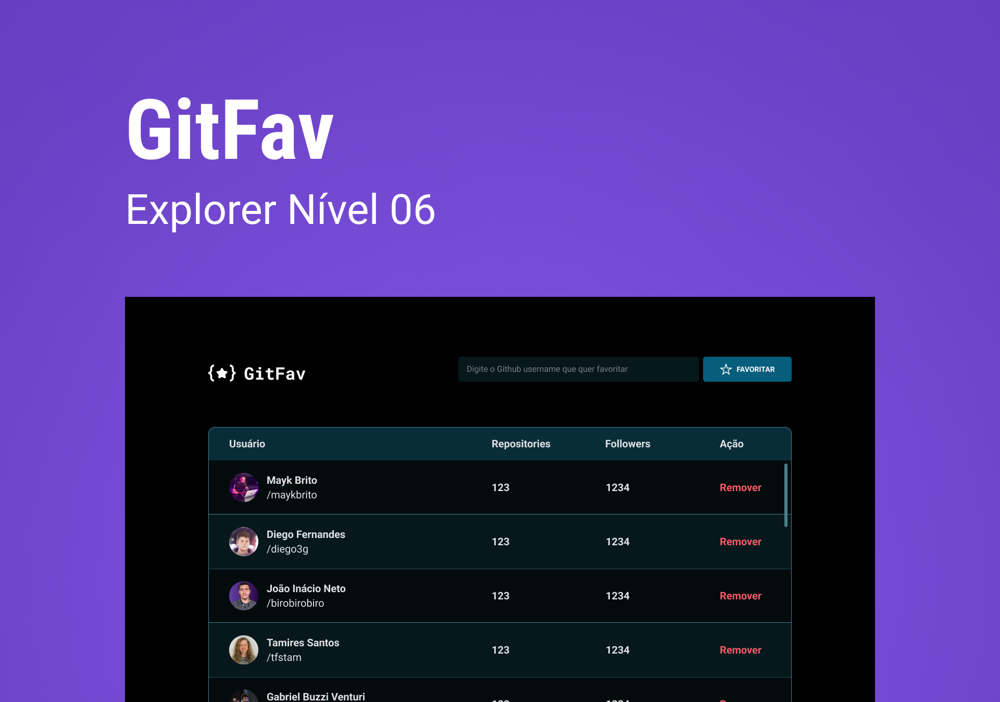

<h1 align="center"> GitFav </h1>

This project was developed during Rocketseat's Explorer course as a way to fix javascript concepts.  

  <a href="#-tech">Tech</a>&nbsp;&nbsp;&nbsp;|&nbsp;&nbsp;&nbsp;
  <a href="#-project">Project</a>&nbsp;&nbsp;&nbsp;|&nbsp;&nbsp;&nbsp;
  <a href="#-layout">Layout</a>&nbsp;&nbsp;&nbsp;|&nbsp;&nbsp;&nbsp;
  <a href="#memo-licença">License</a>

  

 

  

## 🚀 Tech

This project was developed with the following technologies:

- HTML
- CSS
- JavaScript
- Git and Github
- Figma

## 💻 Project

Gitfav is an app where you can find github users and favorite them so you can have a list of the best profiles there and check their numbers of repositories and followers. You can also remove them afterwards if you change your mind.

- [Access the deploy of this project online](https://brunaporato.github.io/gitfav/)

## 🔖 Layout

Check the project layout on [Figma](https://www.figma.com/file/jcJry85tWfPc3tE16r060l/%5BDesafios-Explorer%5D-GitFav-(Copy)-(Copy)?node-id=0-1&t=Gqy4Hc7KUMMNDjOy-0).

## :memo: License

This project is under MIT license.

---
 

Thank you for checking ♥ :wave:
 
< brunaporato / >

